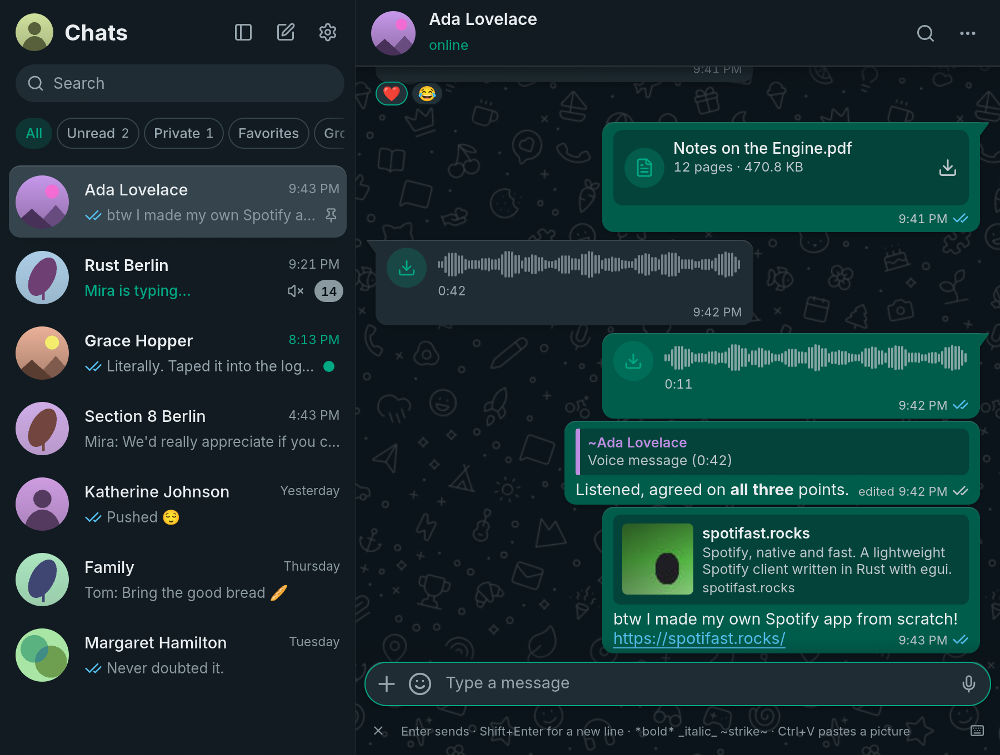
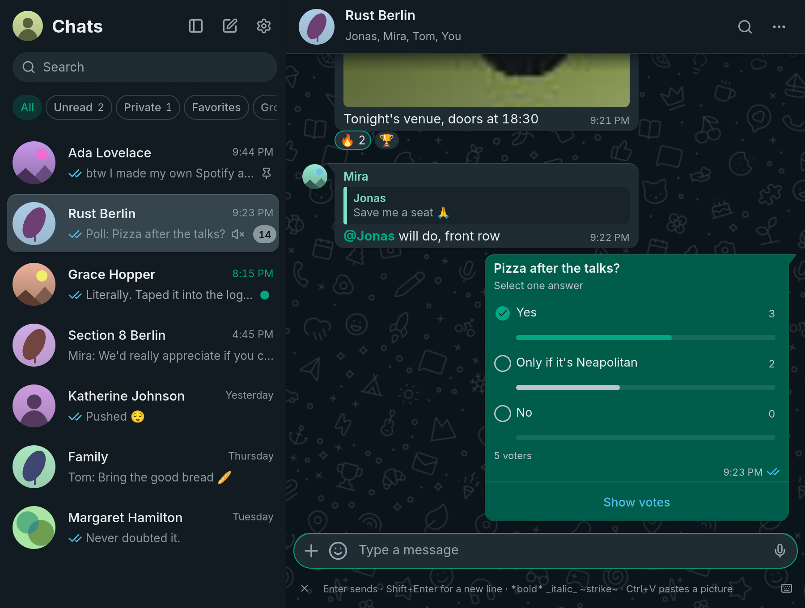
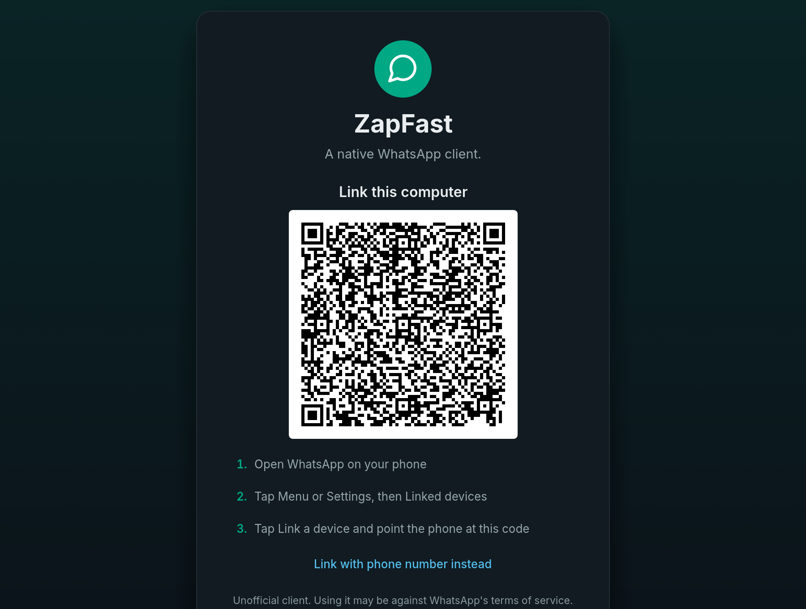

# ZapFast

**WhatsApp, native and fast.** ZapFast is a WhatsApp client written in Rust
with [egui](https://github.com/emilk/egui). It uses
[whatsapp-rust](https://github.com/oxidezap/whatsapp-rust) for the WhatsApp Web
protocol. It runs on Linux, macOS, and Windows, links to your phone as a
companion device, and has no browser engine. In our Linux test, it opened in
under a second and used about 150 MB of idle RAM, compared with 1.13 GB for
WhatsApp Web and its Chromium processes. [See the measurements](https://zapfast.rocks/benchmarks/).

ZapFast is a sibling of [Spotifast](https://spotifast.rocks),
with the same native UI for a different service.



See **[zapfast.rocks](https://zapfast.rocks)** for downloads and guides.





## What it does

- **Links to your phone.** Scan a QR code or link with your phone number.
  Recent history is copied to this computer after linking and stored here.
- **Chats.** See pinned, unread, muted, and archived chats, typing indicators,
  and message status. Search chats, saved messages, and contacts.
- **Read state across devices.** Reading a chat syncs its unread badge with
  your phone and other linked devices, including when read receipts are off.
  Replies from another device clear preceding unread messages. The read-receipt
  toggle also controls voice-message played receipts; account privacy is checked
  before sending receipts in direct chats. A hidden window does not read messages.
- **Conversations.** See replies, reactions, edits, deleted messages, read
  receipts, sender names, and group pictures. Older messages load as you
  scroll up, first from the local archive and then from your phone.
  Group messages show two gray checks after every recipient has received
  them, and blue checks after every recipient has read them. The recipient
  list and individual receipts are saved locally; later membership changes
  do not change that list. If the original recipients are unknown, ZapFast
  waits for the phone's aggregate status instead of guessing from one reader.
- **WhatsApp formatting.** Bold, italic, strikethrough, code, lists, quotes,
  mentions, and link previews are supported. Links are clickable. Emoji use
  the desktop's color emoji font, with a bundled fallback, and emoji-only
  messages are larger.
- **Send attachments with captions.** Paste a picture, drop files, or use the
  file picker. They stay in the composer until you send them or press Escape.
- **Mute chats** for eight hours, one week, or indefinitely. The setting also
  applies on your phone and to desktop notifications.
- **Voice messages.** Play, seek, record, reply with, and send voice messages
  in the chat. The app normalizes quiet recordings and handles OGG/Opus
  without external tools.
- **Send messages.** Press Enter to send text and Shift+Enter for a new line.
  You can swap these keys in Settings. The composer is focused when you open
  or return to a conversation; invoking search keeps focus in search, and
  Escape clears search and returns to the composer. Type `:name` to autocomplete
  an emoji without leaving the composer, or `@` in a group to mention a member.
  Reply, react, edit, forward, delete, and check when a message was sent,
  delivered, or read.
- **Disappearing-message timers.** Outgoing messages use the chat's known
  timer, including replies, attachments, edits, and forwards. Forwarded copies
  use the destination chat's timer. Received messages remain in the local archive
  after they expire on the phone.
- **View attachments.** ZapFast downloads files up to 64 MB automatically or
  on click. Photos, stickers, GIFs, voice messages, audio, locations, contacts,
  polls, and link previews appear in the chat. Videos and documents open in
  their default desktop apps. If an attachment has expired, ZapFast asks your
  phone to upload it again.
- **Emoji, GIF, and sticker picker.** Search emoji and GIFs, use recent emoji
  and stickers, and save stickers with a right-click. Emoji autocomplete and
  picker search select their first match; use the arrow keys and Enter to
  choose it. GIF search needs a free GIPHY API key unless the build includes
  one.
- **Sticker packs.** Import a pack from a `signal.art` link or `.wastickers`
  file. Animated packs remain animated. Packs are stored as WebP files on your
  computer.
- **Consistent names.** Use names from your address book or public WhatsApp
  profile names across chats, replies, mentions, and notifications.
- **Groups.** See members, sender names, and sender pictures. Announcement
  groups are read-only for non-admins.
- **Presence.** See online, last-seen, and typing status, and send your typing
  status.
- **Runs in the background.** Closing the window keeps ZapFast linked in the
  system tray. Reopen it from the tray or by launching it again. Quit from the
  tray or with `Ctrl+Q`, or disable this behavior in Settings.
- **Desktop notifications.** Get notifications with the chat picture when you
  are away from the open chat. Muted chats do not notify you. On Linux,
  clicking a notification opens the chat, and reading the chat here or on another
  device dismisses its outstanding notifications.
- **Update notices.** ZapFast checks GitHub once a day and shows a download
  link when a newer release is available. You can turn this off in Settings.
- **Light and dark**, or follow the system. Zoom with Ctrl+plus and
  Ctrl+minus.
- **Copy text.** Select part of a message or copy across messages in
  WhatsApp's `[time, date] Name:` format. Contact names and numbers are also
  selectable.
- **Keyboard shortcuts.** `Ctrl+K` searches, `Alt+↑/↓` switches chats and
  keeps the active chat visible in the list, `Esc` cancels the current action,
  and `Ctrl+/` lists all shortcuts.
- **Local storage.** Messages are stored in one SQLite file and attachments
  in the cache directory. Unlinking deletes both and removes this device from
  your phone.

## What it does not do yet

- Play ordinary videos in the app (they open in your player), or reply to
  a message with an attachment.
- Calls, status posts, communities, newsletters, and group administration.

## Installing

ZapFast was previously called FastsApp. Version 0.13.0 introduces the new
package and executable names. On Arch Linux:

```sh
yay -S zapfast-bin      # the released build, ready made
yay -S zapfast          # the release, built from source
yay -S zapfast-git      # built from the latest commit
```

Builds for every release are on the
[releases page](https://github.com/crmne/zapfast/releases):

| Platform | File |
| --- | --- |
| Linux x86_64 and arm64 | `zapfast-vX.Y.Z-<target>.tar.gz`, with the desktop file and icon in `packaging/` |
| Windows x64 and arm64 | `zapfast-vX.Y.Z-<target>-setup.exe` (no administrator rights needed), or the `.zip` |
| macOS, universal | `zapfast-vX.Y.Z-macos-universal.dmg` |

On macOS, the rounded Dock icon matches the app bundle. Native menus provide
Settings, editing, search, view controls, and window commands. The traffic
lights share the chat header, leaving more room for conversations in a normal
window. Settings is also available with `⌘,`.

The macOS release process signs the app with Developer ID, submits the DMG
to Apple's notarization service, and staples and validates its ticket before
publishing. Open the DMG and drag **ZapFast** to Applications.
When upgrading from FastsApp on macOS, quit the old app and remove its
application bundle after installing ZapFast.

Releases before 0.13.0 keep their original FastsApp filenames.

### From source

ZapFast needs Rust. `rust-toolchain.toml` pins the exact version. On Linux,
it also needs GUI development packages:

```sh
# Debian and Ubuntu
sudo apt install libxkbcommon-dev libwayland-dev libgl1-mesa-dev
# Arch
sudo pacman -S libxkbcommon wayland mesa
```

Then:

```sh
cargo install --path .
zapfast
```

The desktop file and icon are in `packaging/`.

`whatsapp-rust` is pinned to a Git commit because version 0.7.0 on crates.io
enables a `simd` feature that needs nightly Rust. The pinned commit builds on
stable Rust.

## Using it

On first start, scan the QR code from WhatsApp under **Linked devices**,
**Link a device**. To link without the camera, click **Link with phone number
instead**, enter your number with its country code, then enter the shown code
on your phone.

WhatsApp then sends your recent history. This can take a few minutes. A banner
shows the progress. New messages arrive live, and your phone does not need to
stay on the same network.

Right-click a chat or message to open its menu. Open Settings from the gear or
with `Ctrl+,`. Use the pencil to message a new number or save a contact. You
can also open a group member's contact card. Saved names sync through WhatsApp
to your phone and linked devices.

## Files

| What | Linux | Notes |
| --- | --- | --- |
| Settings | `~/.config/zapfast/settings.json` | JSON, safe to edit |
| Device keys | `~/.local/state/zapfast/session.db` | Owned by whatsapp-rust; deleting it unlinks |
| Messages | `~/.local/state/zapfast/archive.db` | SQLite; raw messages contain the keys needed to download attachments |
| Attachments, avatars | `~/.cache/zapfast/` | Safe to delete |
| Saved stickers and packs | `~/.local/state/zapfast/stickers/` | Plain WebP files; each pack is a folder |
| Log of the last run | `~/.local/state/zapfast/zapfast.log` | `--verbose` for more |

macOS and Windows use the standard platform directories selected by the
`directories` crate. On first start, ZapFast moves settings, the linked session,
message archive, saved stickers, caches, and window state from `fastsapp`
(or the earlier `fastwhatsapp`) paths. Existing ZapFast directories take
precedence and are never overwritten. Quit FastsApp before starting ZapFast;
if an older copy is still running, the new launch brings its window forward.
Your phone may keep showing the old linked-device name until you link again.

## Developing

```sh
cargo run --features demo -- --demo            # sample chats, no connection
cargo run --features demo -- --demo-page login # or settings, pair, info, light, …
cargo run --features demo -- --demo-shot shot.png --demo-page chat,light
cargo run --features demo -- --demo-tour      # Space starts/replays a 41-second tour
cargo test --all-features                      # includes a headless layout of every screen
cargo clippy --all-targets --all-features -- -D warnings
```

To include a default GIPHY key for GIF search, set it at build time. A key in
Settings overrides it:

```sh
ZAPFAST_GIPHY_KEY=your-key cargo build --release
```

The earlier `FASTSAPP_GIPHY_KEY` build variable remains supported as a fallback.

`AGENTS.md` describes the architecture and the rules for changes.

### Recording a demo

The `demo` feature uses offline sample chats in a fresh temporary directory.
It does not open your linked account, read your message archive, connect to
WhatsApp, or register a tray icon. You can run it alongside your regular app.

```sh
cargo build --locked --features demo
./target/debug/zapfast --demo-tour --demo-size 1280x800
```

The **ZapFast Demo** window waits for **Space**. The 41-second tour starts with
search, switches chats with keyboard shortcuts, scrolls, right-clicks a message
and selects Reply, types quickly, completes emoji and mentions, searches the GIF
picker and sends a still sticker, opens group information and the shortcut list,
and changes themes through Settings. It uses the normal mouse and keyboard handlers;
a local responder handles outgoing messages with no WhatsApp connection.
The GIF-search thumbnails and still stickers are rendered from the bundled
Noto emoji font; demo GIF search uses these local fixtures. The tour makes no
sound and holds its final frame. Space rebuilds the sample and replays.
For an automatic start, add `--demo-tour-delay 5000` (milliseconds).
Use `--demo` instead of `--demo-tour` to explore the sample chats yourself.

On Omarchy, run `omarchy screenrecord`, select the demo window, then press Space
in ZapFast. Recording has no audio unless you explicitly enable desktop or
microphone audio. Stop with `omarchy screenrecord --stop-recording` after the
tour finishes. The default capture records a fixed rectangle, so keep the demo
window visible and stationary until recording stops.

To annotate the video with a visible pointer, click rings, and outlined shortcut
labels, add `--demo-tour-events tour.json` when launching the tour. After
recording, run:

```sh
python3 scripts/render-demo.py recording.mp4 tour.json launch.mp4 --start 0.8
```

Set `--start` to the recording time (in seconds) when you pressed Space. The
export trims the setup footage, adds a caption band below the app, and produces
a silent H.264 MP4. It requires `ffmpeg` with libass support and `ffprobe`.
These annotations are added during video export, not drawn by the app. The
trace contains only pointer coordinates and shortcut labels, not typed text.

## Disclaimer

ZapFast is an unofficial client and is not affiliated with WhatsApp or
Meta. Using an unofficial client may be against WhatsApp's terms of service
and could get an account suspended. Use it at your own risk.

## Packaging maintenance

Release packaging uses the [native-packages](https://rubygems.org/gems/native-packages) gem. macOS release builds automatically sign and notarize when the Apple CI credentials are configured. `native-packages.yaml` declares packages and downstream repositories; native recipes and installation assets live in `packaging/`; see [PACKAGING.md](PACKAGING.md) for local commands and CI behavior.

## License

MIT. Inter and Noto Color Emoji are under the SIL Open Font License; the icons
are from [Lucide](https://lucide.dev) (ISC).
